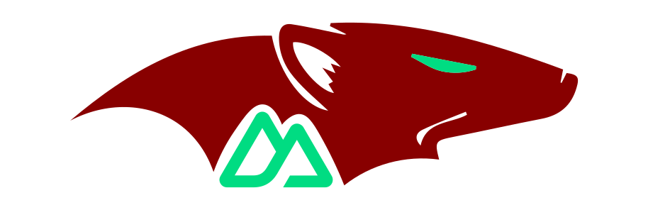

<div align="center">
  <h1>Nuxt Mongoose</h1>

  A Nuxt module for simplifying the use of Mongoose in your project.
</div>


## Installation

```bash
pnpm add nuxt-mongoose
```

## Usage

### Setup

Add `nuxt-mongoose` to the `modules` section of your `nuxt.config.ts` file.

```ts
export default defineNuxtConfig({
  modules: [
    'nuxt-mongoose',
  ],
})
```

### Configuration

You can configure the module by adding a `mongoose` section to your `nuxt.config` file.

```ts
export default defineNuxtConfig({
  mongoose: {
    uri: 'process.env.MONGODB_URI',
    options: {},
  },
})
```

* for more information about the options, please refer to the [Mongoose documentation](https://mongoosejs.com/docs/connections.html#options). *

## API

### defineMongooseConnection

This function creates a new Mongoose connection. Example usage:

```ts
import { defineMongooseConnection } from '#nuxt/mongoose'

export const connection = defineMongooseConnection('mongodb://127.0.0.1/nuxt-mongoose')
```

### defineMongooseModel

This function creates a new Mongoose model with schema. Example usage:

```ts
import { defineMongooseModel } from '#nuxt/mongoose'

export const User = defineMongooseModel('User', {
  name: {
    type: String,
    required: true,
  },
})
```

**or you could use it like:**

```ts
export const User = defineMongooseModel({
  name: 'User',
  schema: {
    name: {
      type: String,
      required: true,
    },
  },
})
```

### useMongoose

This composable returns the Mongoose DB instance. Example usage:

```vue
<script lang="ts" setup>
const mongoose = useMongoose()
const user = await mongoose.db.collection('users').findOne()
</script>
```

## License

[MIT License](./LICENSE)
